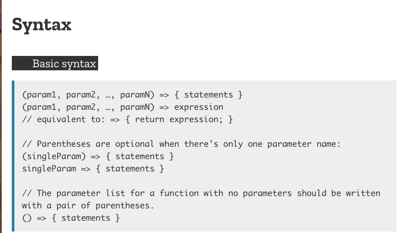
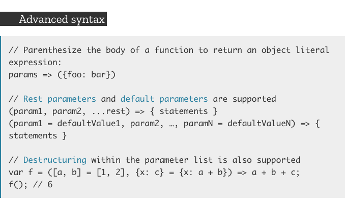

# ES6 Arrow Functions

> arrow functions retain the this value of the enclosing functional scope. 

 ## Arrow function expressions are ill suited as methods, and they cannot be used as constructors.

> Therefore, you will want to **avoid using an arrow function in a constructor** (where we need the contextual this to be the object we are building) or any method that needs to use this to behave properly.

