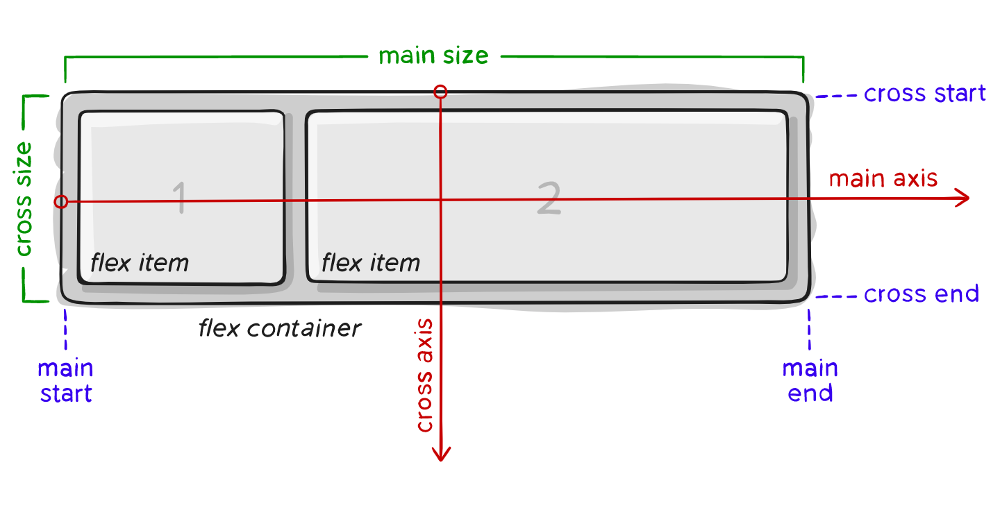
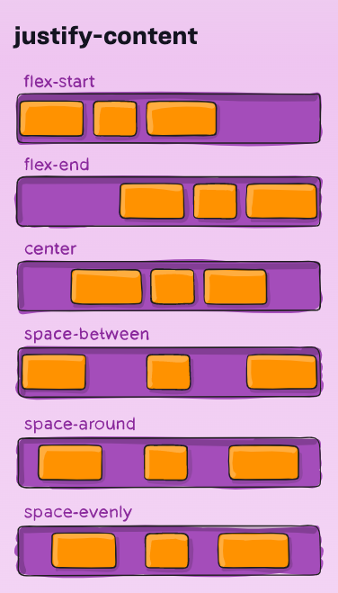
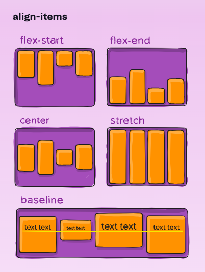
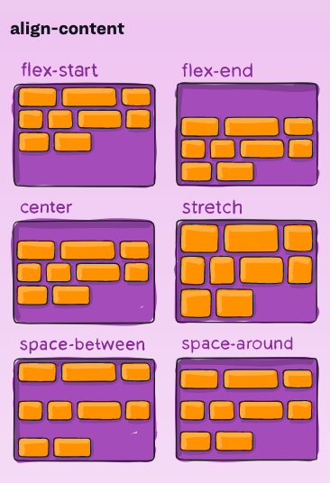
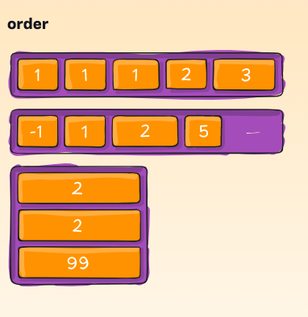
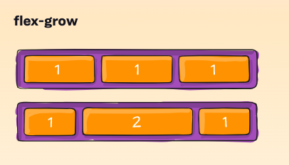

# Read: 03 - Flexbox and Templating

## [Templating with Mustache](https://medium.com/@1sherlynn/javascript-templating-language-and-engine-mustache-js-with-node-and-express-f4c2530e73b2)
- Javascript templating is a fast and efficient technique to render client-side view templates with Javascript by using a JSON data source. 
- Mustache is a logic-less template syntax. 
  - It works by expanding tags in a template using values provided in a hash or object.
  - It is often referred to as “logic-less” because there are no if statements, else clauses, or for loops. 
  - Instead, there are only tags. Some tags are replaced with a value, some nothing, and others a series of values. 
- mustache.js is an implementation of the mustache template system in JavaScript. 
- It is often considered the base for JavaScript templating. 
-  Mustache is NOT a templating engine. 
  - Mustache is a specification for a templating language. 
  - In general, we would write templates according to the Mustache specification, and it can then be compiled by a templating engine to be rendered to create an output.

## [A Guide to Flexbox](https://css-tricks.com/snippets/css/a-guide-to-flexbox/)
- Since flexbox is a whole module and not a single property, it involves a lot of things including its whole set of properties.

- Items will be laid out following either the main axis (from main-start to main-end) or the cross axis (from cross-start to cross-end).
  - ***main axis*** – The main axis of a flex container is the primary axis along which flex items are laid out. Beware, it is not necessarily horizontal; it depends on the flex-direction property (see below).
  - ***main-start | main-end*** – The flex items are placed within the container starting from main-start and going to main-end.
  - ***main size*** – A flex item’s width or height, whichever is in the main dimension, is the item’s main size. The flex item’s main size property is either the ‘width’ or ‘height’ property, whichever is in the main dimension.
  - ***cross axis*** – The axis perpendicular to the main axis is called the cross axis. Its direction depends on the main axis direction.
  - ***cross-start | cross-end*** – Flex lines are filled with items and placed into the container starting on the cross-start side of the flex container and going toward the cross-end side.
  - ***cross size*** – The width or height of a flex item, whichever is in the cross dimension, is the item’s cross size. The cross size property is whichever of ‘width’ or ‘height’ that is in the cross dimension.

#### Properties for the Parent or flex container
- ***display*** - This defines a flex container; inline or block depending on the given value. It enables a flex context for all its direct children.
- ***flex-direction*** - This establishes the main-axis, thus defining the direction flex items are placed in the flex container. Flexbox is (aside from optional wrapping) a single-direction layout concept. Think of flex items as primarily laying out either in horizontal rows or vertical columns.
  - **row (default):** left to right in ltr; right to left in rtl
  - **row-reverse:**  right to left in ltr; left to right in rtl
  - **column:** same as row but top to bottom
  - **column-reverse:** same as row-reverse but bottom to top
- ***flex-wrap*** - By default, flex items will all try to fit onto one line. You can change that and allow the items to wrap as needed with this property.
  - **nowrap (default):** all flex items will be on one line
  - **wrap:** flex items will wrap onto multiple lines, from top to bottom.
  - **wrap-reverse:** flex items will wrap onto multiple lines from bottom to top.
- ***flex-flow*** - This is a shorthand for the flex-direction and flex-wrap properties, which together define the flex container’s main and cross axes. The default value is row nowrap.
- ***justify-content*** - This defines the alignment along the main axis. It helps distribute extra free space leftover when either all the flex items on a line are inflexible, or are flexible but have reached their maximum size. It also exerts some control over the alignment of items when they overflow the line.
- The safest values are flex-start, flex-end, and center because some values are not supported by all browers.
- There are also two additional keywords you can pair with these values: **safe** and **unsafe**. Using **safe** ensures that however you do this type of positioning, you can’t push an element such that it renders off-screen (e.g. off the top) in such a way the content can’t be scrolled too (called “data loss”).

  - **flex-start (default):** items are packed toward the start of the flex-direction.
  - **flex-end:** items are packed toward the end of the flex-direction.
  - **start:** items are packed toward the start of the writing-mode direction.
  - **end:** items are packed toward the end of the writing-mode direction.
  - **left:** items are packed toward left edge of the container, unless that doesn’t make sense with the flex-direction, then it behaves like start.
  - **right:** items are packed toward right edge of the container, unless that doesn’t make sense with the flex-direction, then it behaves like start.
  - **center:** items are centered along the line
  - **space-between:** items are evenly distributed in the line; first item is on the start line, last item on the end line
  - **space-around:** items are evenly distributed in the line with equal space around them. Note that visually the spaces aren’t equal, since all the items have equal space on both sides. The first item will have one unit of space against the container edge, but two units of space between the next item because that next item has its own spacing that applies.
  - **space-evenly:** items are distributed so that the spacing between any two items (and the space to the edges) is equal.
- ***align-iems*** - This defines the default behavior for how flex items are laid out along the cross axis on the current line. 
- The safe and unsafe modifier keywords can be used in conjunction with all the rest of these keywords (although note browser support), and deal with helping you prevent aligning elements such that the content becomes inaccessible.

- ***align-content*** - This aligns a flex container’s lines within when there is extra space in the cross-axis, similar to how justify-content aligns individual items within the main-axis.
> Note: this property has no effect when there is only one line of flex items.

  - **flex-start / start:** items packed to the start of the container. The (more supported) flex-start honors the flex-direction while start honors the writing-mode direction.
  - **flex-end / end:** items packed to the end of the container. The (more support) flex-end honors the flex-direction while end honors the writing-mode direction.
  - **center:** items centered in the container
  - **space-between:** items evenly distributed; the first line is at the start of the container while the last one is at the end
  - **space-around:** items evenly distributed with equal space around each line
  - **space-evenly:** items are evenly distributed with equal space around them
  - **stretch (default):** lines stretch to take up the remaining space

#### Properties for the Children or flex items
- ***order*** - By default, flex items are laid out in the source order. However, the order property controls the order in which they appear in the flex container.

- ***flex-grow*** - This defines the ability for a flex item to grow if necessary. It accepts a unitless value that serves as a proportion. It dictates what amount of the available space inside the flex container the item should take up.
- If all items have flex-grow set to 1, the remaining space in the container will be distributed equally to all children. If one of the children has a value of 2, the remaining space would take up twice as much space as the others (or it will try to, at least).

- ***flex-shrink*** - This defines the ability for a flex item to shrink if necessary.
- ***flex-basis*** - This defines the default size of an element before the remaining space is distributed. 
  - The **auto** keyword means “look at my width or height property” (which was temporarily done by the main-size keyword until deprecated). 
  - The **content** keyword means “size it based on the item’s content” – this keyword isn’t well supported yet, so it’s hard to test and harder to know what its brethren max-content, min-content, and fit-content do.
- ***flex*** - This is the shorthand for flex-grow, flex-shrink and flex-basis combined. The second and third parameters (flex-shrink and flex-basis) are optional. The default is 0 1 auto, but if you set it with a single number value, it’s like 1 0.
  - ***BEST PRACTICE*** It is recommended that you use this shorthand property rather than set the individual properties. The shorthand sets the other values intelligently.

## [Flexbox Froggy](https://flexboxfroggy.com/)
- this is a tutorial

## [Mustache.js Official Documentation](https://github.com/janl/mustache.js)